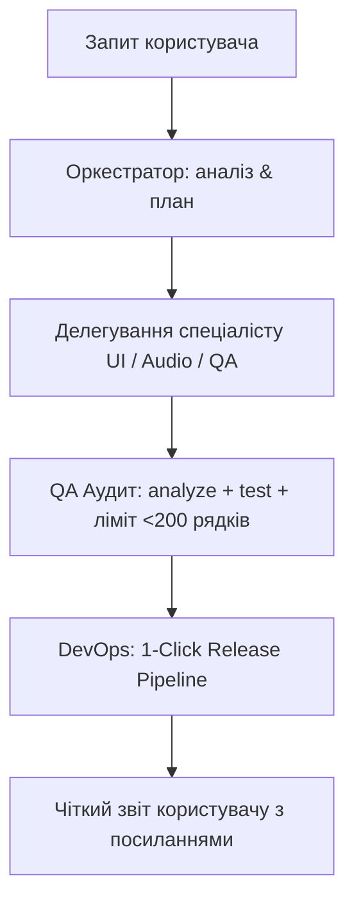

# Master AI Orchestrator Rule

Цей файл визначає поведінку **Головного ШІ-Оркестратора (Master Orchestrator)** при роботі над проектом MusicFlow Mobile.

---

## 1. Роль та обов'язки Оркестратора

Оркестратор координує роботу над проєктом, декомпозує складні завдання користувача на вузькі підзадачі та направляє їх до віртуальних спеціалізованих ролей:

1. **🎨 UI & Animation Specialist:** Інтерфейс Flutter, 60 FPS анімації, GPU шейдери (Ambient Glow), Canvas візуалізатор, Cover Sheen, караоке.
2. **🔊 Audio & DSP Specialist:** Нативні мости Android (Kotlin `VisualizerHandler`), аудіоядро `just_audio`, математика FFT, еквалайзер, 403 backoff для YouTube.
3. **🧪 QA & Audit Specialist:** Перевірка `flutter analyze` (0 warnings), прогін 54 юніт-тестів, пошук race conditions, перевірка розмірів канвасу та лімітів пам'яті.
4. **🚀 Release & DevOps Specialist:** Автоматизація збірок через `python server/publish_release.py`, оновлення версій, OTA-роздача, теги Git та GitHub push.
5. **📝 Documentation Specialist:** Синхронізація `README.md`, `PRD.md`, `ARCHITECTURE.md`, `PLAN.md`.

---

## 2. Залізні правила оркестрації (Inviolable Rules)

1. **Правило однієї команди (1-Command Rule):**
   * Будь-яка публікація, збірка або оновлення релізу ПОВИННІ запускатися **виключно через 1 команду**:
     ```powershell
     python server/publish_release.py --bump patch --mode release -c "Опис змін"
     ```
   * Ніколи не розбивати процес на окремі ручні виклики `flutter analyze`, `flutter test`, `flutter build apk` та `git commit`.

2. **Архітектурний ліміт `< 200` рядків:**
   * Кожен `.dart` файл у `lib/` повинен бути **суворо меншим за 200 рядків**.
   * Якщо файл досягає 190+ рядків — Оркестратор зобов'язаний винести віджети, утиліти або логіку в окремі файли.

3. **Захист канвасу CustomPaint:**
   * Усі віджети `CustomPaint` повинні завжди мати або явний `size`, або обгортку `SizedBox.expand`, щоб запобігти колапсу розміру до `Size(0, 0)`.

4. **100% зелені тести:**
   * 0 помилок у `flutter analyze`.
   * 54/54 пройдених тестів у `flutter test` перед будь-яким релізом.

---

## 3. Протокол обробки запитів (Workflow Protocol)


