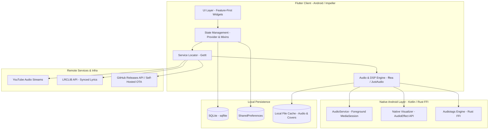
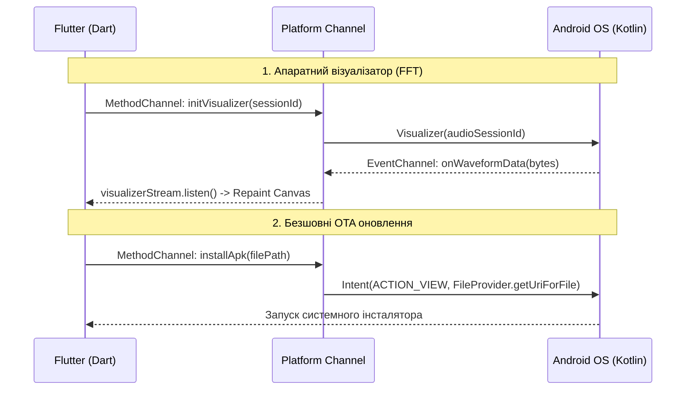

# Системна архітектура MusicFlow Mobile (ARCHITECTURE.md)

Цей документ описує високорівневу та модульну архітектуру проекту **MusicFlow Mobile**, принципи побудови кодової бази, структуру взаємодії компонентів та нативні мости.

---

## 1. Загальний огляд системи (High-Level Architecture)

MusicFlow побудований за принципом **багаторівневої клієнт-серверної архітектури** з високим ступенем автономності клієнта:



---

## 2. Ключове архітектурне правило: `< 200` рядків на файл

У проєкті діє суворе архітектурне обмеження:
> **Жоден файл коду в директорії `lib/` не може перевищувати 199 рядків (максимум 200).**

### Чому це запроваджено:
1. **Висока зв'язність (High Cohesion):** Кожен клас або віджет виконує строго одну відповідальність (Single Responsibility Principle).
2. **Низька зачепленість (Low Coupling):** Відсутність монолітних "God-класів" полегшує тестування та ізольовані зміни.
3. **Автоматичний контроль у CI/CD:** Правило контролюється автоматичним тестом `test/architecture/file_length_test.dart`. Якщо хоча б один файл сягає 201 рядка, компіляція релізу автоматично блокується.

---

## 3. Структура проєкту (Feature-First)

Кодова база організована за модульною структурою на основі функціональних модулів (Features):

```
lib/
├── main.dart                        # Точка входу, запуск ініціалізації
├── locator.dart                     # Реєстрація залежностей через GetIt
│
├── core/                            # Глобальна тема, палітра кольорів, спільні стилі
│   ├── app_colors.dart
│   └── app_theme.dart
│
├── models/                          # Незмінні моделі даних (Data Classes)
│   ├── song_model.dart              # Модель треку (локальний / мережевий)
│   ├── history_model.dart           # Історія прослуховувань
│   └── search_filter_model.dart     # Фільтри пошуку
│
├── providers/                       # Менеджмент стану додатку
│   ├── audio_provider.dart          # Головний провайдер відтворення (контейнер міксинів)
│   ├── equalizer_provider.dart      # 10-смуговий еквалайзер
│   ├── visualizer_settings_provider.dart # Налаштування ядер та фізики спектру
│   └── audio/                       # Спеціалізовані міксини AudioProvider
│       ├── queue_manager_mixin.dart
│       ├── playback_controls_mixin.dart
│       ├── crossfade_manager_mixin.dart
│       ├── lyrics_manager_mixin.dart
│       └── preferences_manager_mixin.dart
│
├── features/                        # Візуальні та функціональні модулі
│   ├── player/                      # Екран плеєра, Ambient Glow, Cover Sheen, Візуалізатор
│   ├── library/                     # Локальна медіатека, Alphabet Index Bar
│   ├── lyrics/                      # Синхронні тексти (караоке), скролери
│   ├── search/                      # Пошук по YouTube та локальній бібліотеці
│   ├── settings/                    # Екран налаштувань, екран візуалізатора, OTA-діалог
│   └── main/                        # Головний контейнер з NavigationBar та MiniPlayer
│
├── services/                        # Бізнес-сервіси (Singleton через GetIt)
│   ├── youtube_service.dart         # Стрімінг аудіо з YouTube + 403 Exponential Backoff
│   ├── download_service.dart        # Завантаження треків, обрізка обкладинок, ID3 теги
│   ├── database_service.dart        # SQLite база (треки, плейлісти, історія)
│   ├── update_service.dart          # OTA перевірка та встановлення APK
│   └── telemetry_service.dart       # Збір звітів збоїв за згодою
│
└── utils/                           # Допоміжні утиліти
    ├── fft_processor.dart           # Математика ШПФ для спектрографа
    ├── visualizer_physics.dart      # Фізика падіння крапель, гравітація, відскок
    └── music_search_filter.dart     # Відсів подкастів, інтерв'ю та новин
```

---

## 4. State Management: Міксин-архітектура AudioProvider

Щоб зберегти читабельність і вкластися в ліміт `< 200` рядків, `AudioProvider` використовує **композицію через міксини**:

```
AudioProvider (ChangeNotifier)
  ├── QueueManagerMixin         # Черга відтворення, перемішування (Shuffle), повтор (Repeat)
  ├── PlaybackControlsMixin     # Play / Pause / Seek / Next / Prev / Sleep Timer
  ├── CrossfadeManagerMixin     # Безшовний перехід між треками на 2 аудіоплеєрах
  ├── LyricsManagerMixin        # Пошук, завантаження та парсинг синхронізованих LRC текстів
  └── PreferencesManagerMixin   # Персистентність налаштувань користувача
```

---

## 5. Нативні мости (Platform Channels)



1. **`NativeVisualizerService`:** Через `EventChannel` передає сирі PCM/FFT байти від системного `android.media.audiofx.Visualizer` із частотою 60 кадрів/с для нульової затримки.
2. **`ApkInstallerHandler`:** Безпечна передача APK через `FileProvider` з прапорцем `FLAG_GRANT_READ_URI_PERMISSION` для встановлення оновлень безпосередньо з додатка.

---

## 6. Візуальний стек (Aesthetic Engine)

* **Flowing Ambient Glow:** Використовує апаратне розмиття GPU `ImageFilter.blur(sigmaX: 28.0, sigmaY: 28.0)` поверх живих орбітальних градієнтних сфер, що рухаються за синусоїдальною траєкторією `Curves.easeInOutSine` кожні 4.0 секунди.
* **Canvas Visualizer:** Оптимізований `CustomPaint` із `ValueNotifier<int> _repaintNotifier` для виключення зайвих перемалювань всього дерева віджетів. Перемальовується лише шар канвасу.
* **Cover Sheen:** Динамічний світловий відблиск `LinearGradient` з кутом нахилу та прозорістю, прив'язаною до горизонтального зміщення жесту свайпу.

---

## 7. 1-Click Release & CI/CD Pipeline

Релізи створюються та публікуються однією автоматизованою командою:

```bash
python server/publish_release.py --bump patch --mode release -c "Опис змін"
```

### Фази пайплайну:
1. **Pre-flight Static Check:** Запуск `flutter analyze` (вимагається 0 помилок).
2. **Pre-flight Test Suite:** Запуск 54 автоматичних тестів `flutter test` (включаючи архітектурний тест довжини файлів).
3. **Version Increment:** Оновлення поля `version` у `pubspec.yaml` (наприклад, `1.0.32+33`).
4. **Compilation:** Збірка релізного APK `flutter build apk --release`.
5. **Storage Sync:** Копіювання скомпільованого білда в сховище локального сервера `server/data/updates/app-release.apk`.
6. **Manifest Generation:** Запис версії, розміру файлу та changelog у `server/data/version.json`.
7. **Git Automation:** Додавання змін (`git add -A`), створення коміту, релізного тегу `vX.Y.Z` та відправка в GitHub (`git push origin main --tags`).
