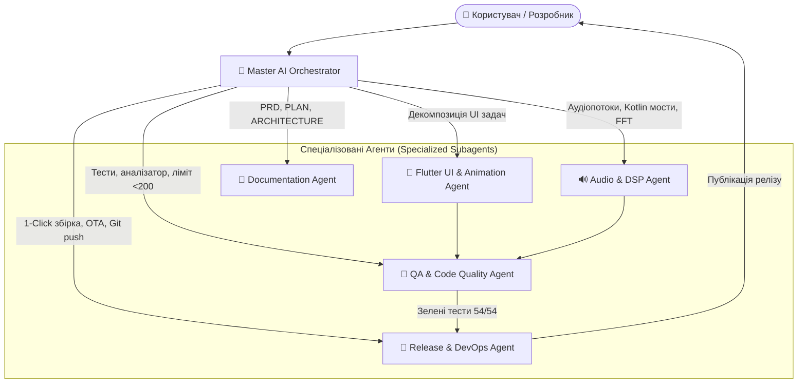

# Мультиагентна система та Оркестратори (ORCHESTRATION.md)

Цей документ описує архітектуру **ШІ-оркестрації (AI Agent Orchestration)** для проєкту **MusicFlow Mobile**, правила взаємодії спеціалізованих агентів та автоматизовані воркфлоу.

---

## 1. Схема оркестрації (Multi-Agent Hierarchy)

---

## 2. Ролі та сфери відповідальності агентів

### 👑 1. Master AI Orchestrator (Головний оркестратор)
* **Файл правил:** `.agents/rules/orchestrator.md`
* **Обов'язок:** Приймає запит користувача, розбиває його на підзадачі, делегує виконання та контролює дотримання ключових правил проєкту.
* **Залізні закони:**
  1. Публікація та реліз — **виключно 1 командою** (`publish_release.py`).
  2. Жоден файл у `lib/` не може перевищувати 199 рядків (суворе правило `< 200`).
  3. `CustomPaint` завжди повинен мати явні межі (`SizedBox.expand` або фіксований `size`).

### 🎨 2. Flutter UI & Animation Specialist
* **Файл правил:** `.agents/rules/flutter_ui_agent.md`
* **Сфера:** Преміальний візуальний стек Apple Music / Pure-music, 60 FPS анімації, Flowing Ambient Glow (28px GPU blur), Cover Sheen, кінетичне пружинне караоке, бічний Alphabet Index Bar.

### 🔊 3. Audio & DSP Specialist
* **Файл правил:** `.agents/rules/audio_dsp_agent.md`
* **Сфера:** Нативні обробники Android Kotlin (`VisualizerHandler.kt`), стрімінг YouTube з Exponential Backoff (захист від 403 помилок), математика швидкого перетворення Фур'є (FFT fftea + Android AudioEffect), еквалайзер.

### 🧪 4. QA & Code Quality Specialist
* **Сфера:** Автоматичний аудит коду перед будь-якою зміною, прогін 54 юніт-тестів, статичний аналізатор `flutter analyze` (0 warnings), захист від витоків пам'яті та race conditions.

### 🚀 5. Release & DevOps Specialist
* **Файл правил:** `.agents/rules/release_devops_agent.md`
* **Скіл:** `.agents/skills/release-pipeline/SKILL.md`
* **Сфера:** Єдиний скрипт `server/publish_release.py`, інженерні pre-flight перевірки, індексація версій у `pubspec.yaml`, компіляція Release APK, синхронізація локального OTA-сервера, оновлення `version.json` та пуш релізних тегів у GitHub.

---

## 3. Як оркестратор керує розробкою

Коли ти даєш завдання, Master Orchestrator автоматично застосовує наступний цикл:

1. **Plan & Decompose:** Аналізує код і відокремлює зміни інтерфейсу від бізнес-логіки.
2. **Execute with Boundaries:** Вносить зміни, гарантуючи, що довжина кожного зміненого файлу залишається `< 200` рядків.
3. **Pre-flight Audit:** Запускає автоматичні тести та лінтер.
4. **1-Command Deploy:** У разі релізу запускає повний пайплайн публікації без зупинок і ручних підказок.
