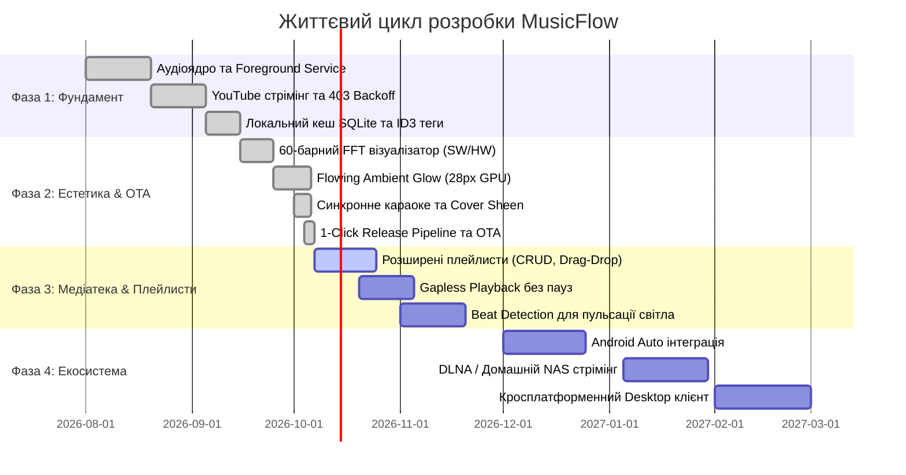

# План реалізації MusicFlow Mobile (PLAN.md)

Цей документ фіксує **дорожню карту розробки (Roadmap)**, поточний статус реалізації, завершені етапи та пріоритети наступних релізів.

**Поточна стабільна версія:** `v1.0.32 (build 33)`  
**Останнє оновлення плану:** Жовтень 2026  

---

## 1. Загальний огляд фаз розробки

---

## 2. Детальний статус реалізації

### ✅ Фаза 1: Аудіоядро та базова функціональність (ВИКОНАНО)
* [x] **Нативне аудіоядро:** Фонове відтворення через `just_audio` + `audio_service` Foreground MediaSession.
* [x] **YouTube Engine:** Пошук аудіо, витягування потоків, авто-поновлення прострочених посилань та Exponential Backoff при помилках 403.
* [x] **Кешування треків:** Збереження аудіо на пристрій, авто-обрізка обкладинки 1:1, запис ID3-тегів через Rust FFI (`audiotags`).
* [x] **SQLite база даних:** Локальна база v3 для обраного, збережених треків, історії прослуховувань та пошуку.
* [x] **10-смуговий еквалайзер:** 12 пресетів, нативне мапування частот (31 Гц – 16 кГц) на аудіочип смартфона.
* [x] **Справжній Crossfade:** Плавний перехід між треками без пауз завдяки двоядерній архітектурі плеєрів.

### ✅ Фаза 2: Естетичний стек Apple Music & Автоматизація (ВИКОНАНО)
* [x] **60-смуговий FFT-візуалізатор:** 
  * Software ядро (fftea) + Hardware ядро (Android AudioEffect Visualizer).
  * 4 режими: *Bars*, *Mirrored*, *Circle*, *Wave*.
  * Фізика падаючих крапель з гравітацією та відскоком.
  * Синхронізація 1:1 розмірів між міні-баром та головним плеєром.
* [x] **Flowing Ambient Glow:** Шовкове 28px розмиття фону плеєра на GPU, синусоїдальне дихання та дві плаваючі колірні орбіти.
* [x] **Cover Sheen:** Динамічний світловий відблиск на обкладинці треку, що реагує на свайп.
* [x] **Синхронізовані тексти:** LRC-караоке з пружинним кінетичним автоскролом та фокусуванням поточного рядка.
* [x] **Alphabet Index Bar:** Алфавітний бічний скролер (#, A-Z, А-Я) з вібровідгуком (вимикається при сортуванні за часом).
* [x] **Архітектурний ліміт:** Рефакторинг усієї кодової бази під суворе правило `< 200` рядків на файл (0 порушень).
* [x] **1-Click CI/CD Pipeline:** Автоматизація збірки релізів, тестів (54 тести), оновлення версії та відправки тегів у GitHub.

---

### 🚀 Фаза 3: Медіатека, плейлисти та розумний звук (В РОБОТІ)

| Задача | Опис | Пріоритет | Цільовий реліз |
|---|---|:---:|:---:|
| **CRUD Плейлистів** | Створення власних користувацьких плейлистів, перейменування, обкладинки | **P0** | `v1.1.0` |
| **Drag & Drop сортування** | Зручна зміна порядку пісень у черзі та плейлистах перетягуванням | **P0** | `v1.1.0` |
| **Імпорт / Експорт .m3u** | Сумісність зі сторонніми плеєрами та резервне копіювання списків | **P1** | `v1.1.1` |
| **Gapless Playback** | Абсолютна відсутність мікропауз між треками (для концептуальних альбомів) | **P1** | `v1.1.2` |
| **Beat Detection DSP** | Аналіз басових ударів для пульсації світлового фону в ритм біта | **P2** | `v1.2.0` |
| **Скробблінг** | Автоматична відправка прослуховувань у Last.fm та ListenBrainz | **P2** | `v1.2.0` |

---

### 🔮 Фаза 4: Екосистема, інтеграції та мультиплатформенність (МАЙБУТНЄ)

| Модуль | Опис | Орієнтовний термін |
|---|---|:---:|
| **Android Auto** | Повноцінний інтерфейс для автомобільних медіасистем через Android Auto Media Browser Service | Q4 2026 |
| **Домашній NAS / DLNA** | Стрімінг аудіо з домашніх сховищ (WebDAV / SMB / DLNA) прямо у спільну бібліотеку | Q1 2027 |
| **Офлайн Smart Mix** | Локальний легкий алгоритм рекомендацій (K-NN на базі жанрів/BPM) без хмарних серверів | Q1 2027 |
| **Desktop версія** | Портування клієнта під Windows, macOS та Linux із збереженням дизайну | Q2 2027 |

---

## 3. Технічний борг та інженерні завдання

- [ ] **Оптимізація пам'яті обкладинок:** Впровадити `ResizeImage` для мініатюр у довгих списках (економія до 30 МБ RAM).
- [ ] **Збільшення тестового покриття:** Довести кількість автоматичних тестів з 54 до 70+ (покриття віджетів караоке та налаштувань).
- [ ] **Автоматичне перевіряння ліміту рядків при Git Commit:** Додати pre-commit хук для блокування файлів > 200 рядків локально.
