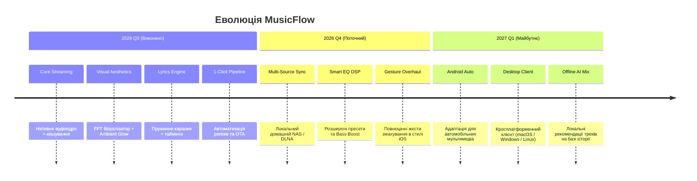

# Product Requirements Document (PRD)
## Project: MusicFlow Mobile
**Document Version:** 1.0  
**Status:** Active / Production  
**Target Platform:** Android (Flutter + Native Audio & DSP)  
**Author:** MusicFlow Core Team  

---

## 1. Executive Summary & Vision

### 1.1 Mission Statement
**MusicFlow** — це преміальний, самодостатній та автономний аудіоплеєр нового покоління, що об'єднує свободу необмеженого стрімінгу музики з YouTube та локальної медіатеки з естетикою та мікроанімаціями рівня Apple Music і Pure-music. Додаток створений для користувачів, які відмовляються платити щомісячну ренту за базові функції плеєра, потребують 100% надійності в умовах блекаутів та цінують бездоганний тактильний і візуальний дизайн.

### 1.2 Філософія продукту
1. **Володіння замість оренди:** Жодних раптових видалень треків через ліцензійні угоди стрімінгів. Якщо трек закешовано — він твій назавжди.
2. **Нульовий бар'єр:** Жодної обов'язкової реєстрації, прив'язки кредитних карток чи нав'язливої реклами.
3. **Естетична безкомпромісність:** Інтерфейс створює відчуття преміального продукту за $10/міс — живий GPU Ambient Glow, тактильний відгук, 60-барний спектральний FFT-візуалізатор та плавне синхронне караоке.
4. **Свобода від Play Store:** Повна автономність завдяки вбудованій системі OTA-оновлень через домашній сервер або GitHub Releases.

---

## 2. Цільова аудиторія та персони користувачів (Target Personas)

| Персона | Профіль | Головний біль у Spotify / Apple Music | Рішення в MusicFlow |
|---|---|---|---|
| **Underground & Remix Hunter** | Слухає нішеву музику, сети, біти, SoundCloud-релізи, український андеграунд | Треки відсутні на комерційних стрімінгах; видаляються за DMCA | Доступ до всієї глибини каталогу YouTube без реклами |
| **Resilience / Blackout User** | Живе в умовах нестабільного зв'язку, блекаутів, частих поїздок у метро | Без платної підписки офлайн-режим заблоковано; шифрований кеш злітає | Миттєве локальне кешування відкритого аудіопотоку; грає автономно |
| **Audiophile & Self-Hoster** | Має домашню бібліотеку FLAC/MP3 на ПК або домашньому NAS | Неможливість зручно об'єднати локальну колекцію зі стрімінгом на телефоні | Wi-Fi синхронізація з домашнім ПК-сервером + підтримка локальних файлів |
| **Aesthetic Enthusiast** | Цінує сучасний UI/UX, динамічне світло, караоке та фізику взаємодії | Безкоштовні плеєри (VLC, NewPipe) виглядають застаріло та грубо | Живий GPU Ambient Glow, відблиски Cover Sheen, плавний скрол текстів пісень |

---

## 3. Конкурентний аналіз (Feature Matrix)

| Критерій | Spotify Free | YouTube Music Premium | NewPipe / ViMusic | Poweramp | **MusicFlow** |
|---|:---:|:---:|:---:|:---:|:---:|
| **Вартість** | $0 (з рекламою) | $5–$11 / міс | $0 | $5–$8 (разово) | **$0 (повний функціонал)** |
| **Фонове відтворення без обмежень** | ❌ Ні | ✅ Так | ✅ Так | ✅ Так | ✅ **Так** |
| **Повна база реміксів та лайвів YouTube** | ❌ Обмежено | ✅ Так | ✅ Так | ❌ Тільки локальні | ✅ **Так** |
| **Преміум GPU Ambient Glow** | ❌ Статичний | ❌ Статичний | ❌ Немає | ❌ Немає | ✅ **Живий 28px Orbit Blur** |
| **Синхронізовані таймінгові тексти (Karaoke)** | ✅ Базові | ❌ Рідко | ❌ Тільки статичні | ❌ Потрібні плагіни | ✅ **Пружинний автоскрол** |
| **Апаратний 60-барний FFT-візуалізатор** | ❌ Немає | ❌ Немає | ❌ Немає | ✅ Базовий | ✅ **SW/HW ядра з фізикою крапель** |
| **Працездатність в 100% офлайні** | ❌ Тільки онлайн | ✅ Тільки кеш підписки | ⚠️ Нестабільно | ✅ Так | ✅ **Повноцінний локальний кеш** |
| **Власна OTA система оновлень** | Play Store | Play Store | F-Droid / GitHub APK | Play Store | ✅ **Вбудований 1-Click OTA** |

---

## 4. Архітектурні та функціональні вимоги

### 4.1 Аудіоядро та стрімінг
* **FR-AUDIO-01:** Фонове відтворення через нативний Android Foreground Service із сповіщенням MediaStyle та підтримкою блокування екрана.
* **FR-AUDIO-02:** Розумна фільтрація пошуку YouTube (автоматичний відсів інтерв'ю, подкастів, новинних роликів та контенту довше 10 хвилин).
* **FR-AUDIO-03:** Кешування треків на внутрішній накопичувач для миттєвого відтворення без повторного завантаження трафіку.
* **FR-AUDIO-04:** Вбудований багатосмуговий еквалайзер із пресетами та нативним керуванням звуковим трактом.

### 4.2 Преміальний візуальний стек (Aesthetic Engine)
* **FR-UI-01 Flowing Ambient Glow:** Динамічний живий фон плеєра з шовковим розмиттям 28px, що дихає за синусоїдальним циклом (4 с) та містить дві контрастні орбітальні світлові сфери під колір обкладинки треку.
* **FR-UI-02 Cover Sheen:** Інтерактивний оптичний блік на обкладинці альбому із реакцією на горизонтальний жест свайпу для перемикання треків.
* **FR-UI-03 Audio Visualizer:**
  * 60 активних стовпчиків із логарифмічною шкалою частот FFT.
  * Два режими ядра: **Software DSP** (програмний аналіз) та **Hardware Core** (нативний Android Visualizer API).
  * 4 візуальних стилі: *Bars*, *Mirrored*, *Circle*, *Wave*.
  * Пікові маркери ("падаючі краплі") із гравітацією та пружним відскоком.
  * Синхронізовані розміри 1:1 на головному міні-барі та повнорозмірному плеєрі.
* **FR-UI-04 Smart Cover:** Кешування обкладинок високої роздільної здатності з плавним затуханням і Hero-анімаціями між екранами.

### 4.3 Система синхронізованих текстів (Lyrics Engine)
* **FR-LYRICS-01:** Підтримка синхронізованих по рядках та складах LRC-файлів.
* **FR-LYRICS-02:** Пружинний кінетичний скрол active-line з фокусуванням поточного рядка.
* **FR-LYRICS-03:** Інтерактивний тап по рядку тексту для миттєвого перемотування аудіо на потрібну секунду треку.

### 4.4 Медіатека та навігація
* **FR-LIB-01 Alphabet Index Bar:** Швидкий бічний алфавітний скролер (#, A-Z, А-Я) з плаваючою бульбашкою поточної літери та тактильним вібро-клацанням (Haptic Feedback).
* **FR-LIB-02 Динамічна логіка сортування:** Автоматичне приховування алфавітної панелі при часовому сортуванні ("За датою додавання") для запобігання візуальної дезорієнтації.

### 4.5 Інфраструктура та доставка оновлень (DevOps & OTA)
* **FR-DEVOPS-01 1-Click Release Pipeline:** Єдиний скрипт `server/publish_release.py`, що автоматично:
  1. Проганяє строгі Pre-flight перевірки (`flutter analyze` + `flutter test`).
  2. Інкрементує версію в `pubspec.yaml`.
  3. Компілює Release APK.
  4. Синхронізує файли в локальний каталог OTA-сервера.
  5. Оновлює маніфест `version.json`.
  6. Створює Git commit + Git Tag + здійснює push у GitHub.
* **FR-DEVOPS-02 In-App OTA Updater:** Клієнт самостійно опитує локальний сервер / GitHub API та дозволяє оновити APK безпосередньо з інтерфейсу "Налаштування".

---

## 5. Нефункціональні вимоги та інженерні стандарти

* **NFR-PERF-01 (Плавність):** Стабільні 60 FPS для всіх анімацій плеєра та візуалізатора на пристроях середнього сегмента (Android 10+).
* **NFR-PERF-02 (Пам'ять):** Споживання RAM не більше 150 МБ у режимі активного відтворення з розмиттям.
* **NFR-ARCH-01 (Модульність коду):** **Строге правило < 200 рядків на файл** для всієї кодової бази `lib/`. Будь-який файл, довший за 200 рядків, автоматично блокує CI/CD пайплайн.
* **NFR-TEST-01 (Тестове покриття):** 100% проходження архітектурних та логічних тестів (понад 50 unit/widget тестів) перед кожною компіляцією.
* **NFR-PRIVACY-01 (Приватність):** Нульовий збір телеметрії, відсутність сторонніх трекерів, робота виключно за прямими запитами користувача.

---

## 6. Стратегічний Roadmap (Майбутній розвиток)

---

## 7. Критерії успіху продукту (Success Metrics)

1. **Технічна стабільність:** Відсутність падінь Foreground Service при згортанні додатка (Crash-free session > 99.5%).
2. **Час старту відтворення:** Запуск першого аудіокадру з мережі менш ніж за 1.2 с при з'єднанні 4G/Wi-Fi.
3. **Автономність оновлень:** Доставка свіжого патчу на телефон користувача за 1 клік менш ніж за 60 секунд.
4. **Користувацька цінність:** Повна відмова користувача від платної підписки на комерційні сервіси завдяки закриттю 100% потреб у щоденному прослуховуванні музики.
