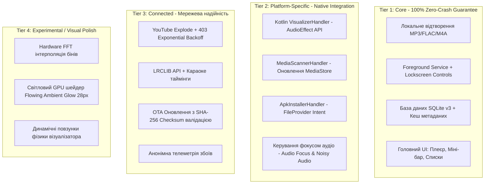
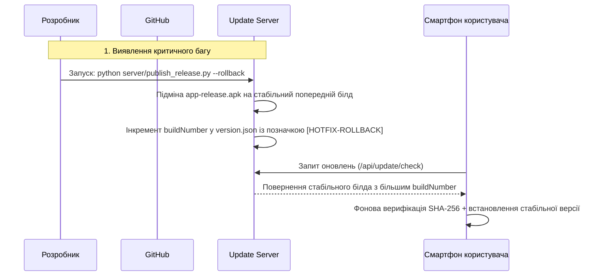

# Матриця сумісності, межі продукту та план відкату (COMPATIBILITY_AND_ROLLBACK.md)

Цей документ визначає технологічні кордони стабільності **MusicFlow Mobile**, матрицю сумісності пристроїв, розподіл підсистем за пріоритетом надійності та регламент аварійного відкату оновлень.

---

## 1. Розподіл компонентів за рівнями надійності (Scope Boundaries)

Щоб уникнути "роздування скоупу" та падіння стабільності на етапі підтримки, усі модулі проєкту чітко розмежовані на 4 рівні:

### Регламент стабільності:
* **Збій у Tier 4** (наприклад, апаратний візуалізатор не зміг ініціалізуватися) **НІКОЛИ не повинен зупиняти відтворення звуку** (Tier 1) — автоматичний фолбек на статичний режим або Software ядро.
* **Збій у Tier 3** (зникнення інтернету, помилка 403) повинен переводити додаток у стан "Очікування мережі / Відтворення з локального кешу" без зависання UI.

---

## 2. Матриця сумісності пристроїв (Compatibility Matrix)

| Параметр | Мінімальні вимоги | Рекомендовані вимоги |
|---|---|---|
| **Версія Android OS** | **Android 8.0 (API Level 26)** | **Android 11–15 (API Level 30–35)** |
| **Архітектура CPU** | `armeabi-v7a` (32-bit), `arm64-v8a` (64-bit), `x86_64` | `arm64-v8a` |
| **Графічний рушій** | OpenGLES 3.0 / Skia | Vulkan / Impeller |
| **Оперативна пам'ять (RAM)** | 2.0 ГБ (споживання додатком < 150 МБ) | 4.0 ГБ+ |
| **Роздільна здатність екрана** | HD (720x1280) | FHD+ (1080x2400) / QHD+ |
| **Підтримка AudioEffect** | Базова (доступна у 95% прошивок) | Повна підтримка апаратного Visualizer |

---

## 3. Регламент безпечних міграцій бази даних (SQLite Migrations)

База даних `music_flow_v3.db` використовує строге версіонування схеми:

1. **Правило збереження даних:** Жодна міграція не має права викликати `DROP TABLE` для таблиць користувацької медіатеки або історії.
2. **Транзакційність:** Усі зміни структури (`ALTER TABLE ADD COLUMN`) виконуються всередині `db.transaction(...)`.
3. **Хеш-перевірка схеми:** При додаванні нових колонок у моделі перевіряється існування поля перед запитом для усунення падінь на старіших версіях.

---

## 4. План аварійного відкату релізу (Emergency Rollback Plan)

Якщо у випущеному релізі виявлено блокуючий регрес (наприклад, краш на специфічній моделі смартфона):

### Кроки швидкого відкату:
1. **Збереження попереднього білда:** Пайплайн завжди зберігає попередній скомпільований білд як `server/data/updates/app-release-previous.apk`.
2. **Hotfix випуск:** Скрипт `publish_release.py` випускає версію з інкрементованим `buildNumber`, але вмістом стабільного коду. Оскільки Android Package Manager не дозволяє даунгрейд за `versionCode`, відкат завжди оформлюється як новий білд із перевіреною базою.
3. **Хмарний відкат:** На GitHub створюється реліз із позначкою `vX.Y.Z-hotfix`.
